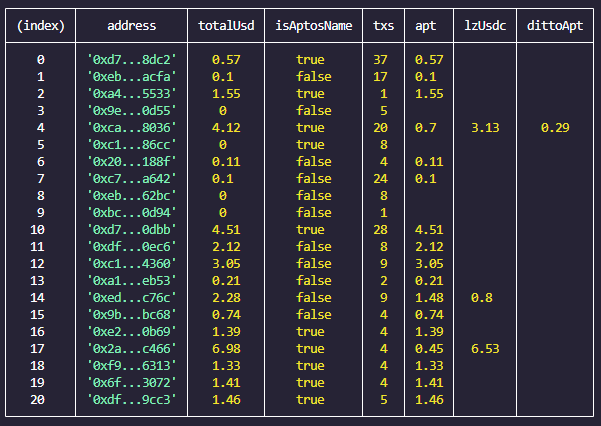

## Functionality:

- Check tokens balance in the aptos network (only tokens provided by the developer). Currently checks APT, lzUsdc, lzUsdt, lzWeth, ditto staked APT, tAPT. You can request another tokens in out chat (link below).
- Check the USD balance of your aptos account.
- Check the number of transactions.
- Verify the availability of an aptos name.

## Installation:

1. Install Node.js from https://nodejs.org/en/download.
2. Place your aptos addresses in the `addresses.txt` file at the root of the folder.
3. Create a .env file in the root folder and populate the required variables using the example file .env.example.
4. Execute `npm install` command to install the necessary dependencies.
5. Modify the configuration (optional) in the src/config.ts file:

- `maxParallelAccounts` - number of accounts checked per request.
- `hideTokensLessThanUsd` - USD threshold to hide tokens in the table (it will exclude them from the total balance).
- `sleepBetweenChunksSec` - pause duration (seconds) between check requests of chunks (maxParallelAccounts).
- `addressFormat` - address format in the table. Can be `short`, `long` or `url`.
- `sortField` - sorting field for the table (excluding index), e.g., `totalUsd` or `txsCount`. Leave empty to retain the order from `addresses.txt`.
- `sortOrder` - sorting order. Can be `asc` or `desc`.

6. Launch the application by running `npm run start` command.

## Additional Links:

This tool works well with the [aptos-simulator](https://github.com/humansimulacrum/aptos-simulator) script for executing aptos account actions like swaps, staking, and NFT purchases.

Explore our scripts on our telegram channel [alfar](https://t.me/+FozX3VZA0RIyNWY6). Feel free to suggest improvements or engage in discussions at our chat (link in channel)

